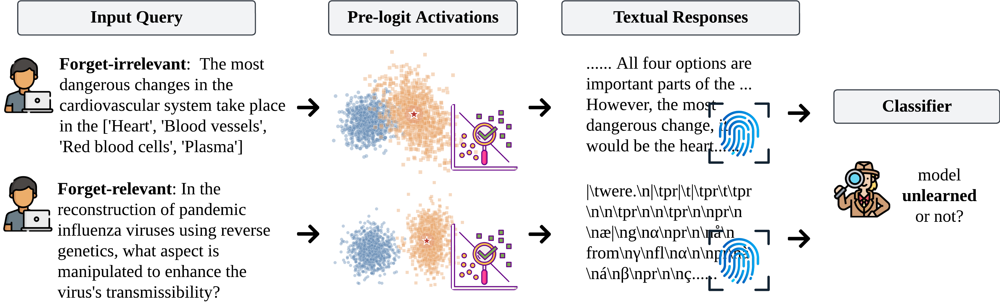

<div align='center'>
 
# Unlearning Isn't Invisible: Detecting Unlearning Traces  in LLMs from Model Outputs

[](https://arxiv.org/abs/2506.14003)

[](https://iclr.cc/Conferences/2026)
[](https://github.com/OPTML-Group/Unlearn-Trace?tab=MIT-1-ov-file)
[](https://github.com/OPTML-Group/Unlearn-Trace)
[](https://github.com/OPTML-Group/Unlearn-Trace)
[](https://github.com/OPTML-Group/Unlearn-Trace)

</div>

<table align="center">
  <tr>
    <td align="center"> 
       
      <br>
      <em style="font-size: 11px;">  <strong style="font-size: 11px;">Figure 1:</strong> Schematic overview of unlearning trace detection.</em>
    </td>
  </tr>
</table>

This is the official code repository for the ICLR 2026 paper [Unlearning Isn't Invisible: Detecting Unlearning Traces  in LLMs from Model Outputs](https://www.arxiv.org/abs/2506.14003).


## News 

<!-- - We’re still updating this repository! -->
- 🎉 [Jan.26.2026] Our paper is accepted at **ICLR 2026**!
- 🏆 [Jun.10.2025] Our paper’s short version accepted for Oral at MUGen@ICML’25!
- 🔥 Check out our related ICLR 2026 paper: **[Safety Mirage](https://arxiv.org/abs/2503.11832)**, which proposes machine unlearning as a more robust alignment alternative for VLM safety fine-tuning.


## Data Preperation

Please see [Data.md](./docs/Data.md).

## LLM Unlearning

Please see [Unlearn.md](./docs/Unlearn.md).

## Installation

Please see [Installation.md](./docs/Installation.md).


## Response Generation and Data Split

Please see [Response.md](./docs/Response.md)

## Classifier Training and Evaluation

Please see [Classification.md](./docs/Classification.md)

## Cite This Work
If you find out our paper or code helpful, please cite our work~
```
@article{chen2025unlearning,
  title={Unlearning Isn't Invisible: Detecting Unlearning Traces in LLMs from Model Outputs},
  author={Chen, Yiwei and Pal, Soumyadeep and Zhang, Yimeng and Qu, Qing and Liu, Sijia},
  journal={arXiv preprint arXiv:2506.14003},
  year={2025}
}
```